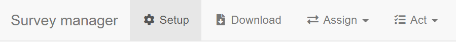
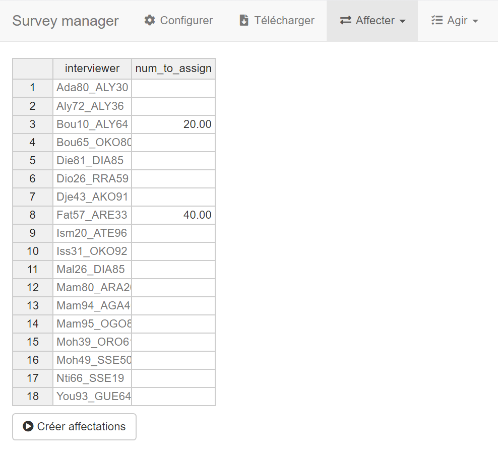
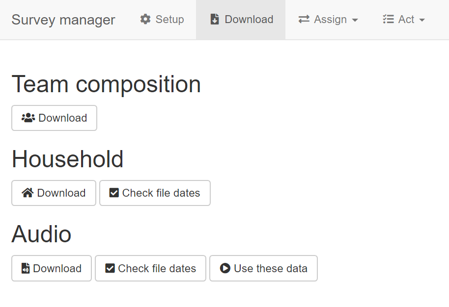
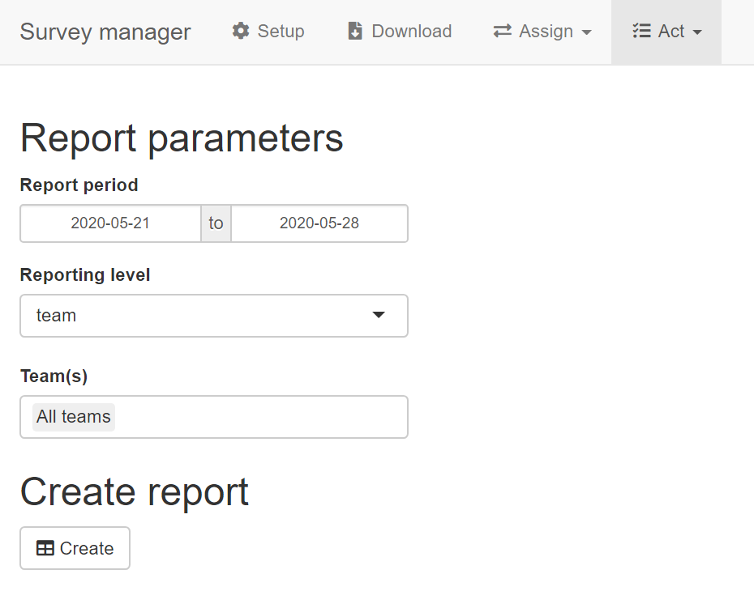
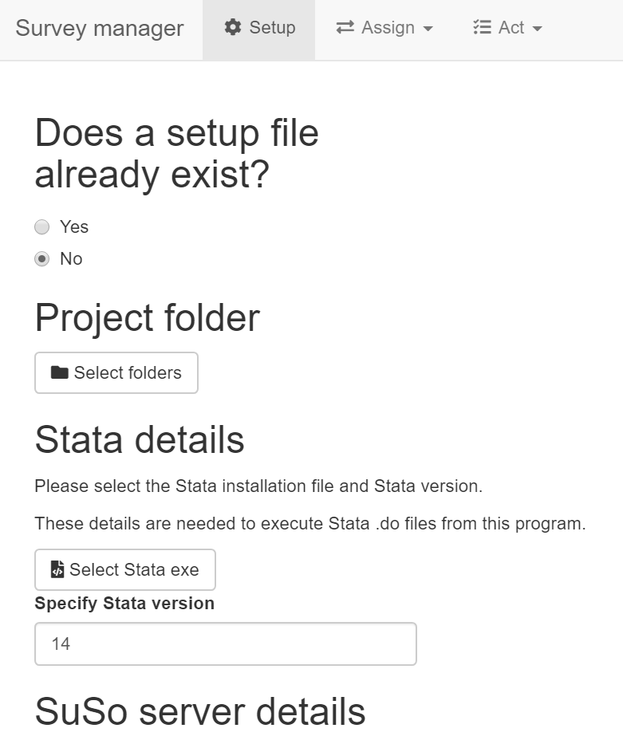

# Overview

An app to facilitate survey management actions:

- Assign interviews with preloaded information
- Download data
- Create monitoring reports

Assign            |  Download | Monitor   
:--------------:|:-----------:|:-------------------------:
  |  | 

#  Table of contents:

- [Installation](#installation)
- [Usage](#usage)
    - [Assign interviews](#assign-interviews)
    - [Download data](#download-data)
    - [Approve/reject](#approvereject)
    - [Monitor](#monitor)

# Installation

Please follow these steps, even if you already have an installation of R or RStudio on your machine:

- [Download repo](#download-repo)
- [Install R](#install-r)
- [Install RStudio](#install-rstudio)

## Download repo

- Click the `Clone or download` button
- Click on the `Download ZIP` option
- Download the repo in the folder on your computer where you would like to store the project

## Install R

- Follow [this link](https://cran.rstudio.com/)
- Click on the appropriate link for your operating system
- Click on `base`
- Download and install

## Install RStudio

- Follow [this link](https://www.rstudio.com/products/rstudio/download/)
- Choose RStudio Desktop Open Source License
- Click on the appropriate link for your operating system
- Download and install

# Setup

## Provide the required data files

Put the required files in the following folder: `/survey-manager/programs/assign-hholds/data/`

Confirm that the files with a household ID have the same ID with the same name in all files, so that simple merging is possible.

The app needs the following files :

- **Sample.** Consists of the households selected for the survey sample. Needs only one variable: the household ID. Do not include non-selected households in the data file.
- **Household.** Consists of household attributes to preload. At a minimum, contains the household ID, phone contacts, names of those contacts, and the language of the interview. 
- **Members.** Consists of information to preload about household members. At a minimum, contains the household ID, the member ID, and the member name.
- **Interviewers and languages spoken.** Contains a list of interviewers in one column, and the languages spoken in several columns. The interviewer column should be called `login` and contain the interviewer's account name. The languages spoken columns should follow this format: `[language_var]_[value] (Name of language spoken)`, where `[language_var]` matches the interview language variable in the household file and `[valeur]` corresponds the the language's code value. Cells must contain a `1`, a `0`, or a blank. See an example from Mali below:

## In-app setup

- Open RStudio
- Open `survey_manager.R` via `File > Open File` in the RStudio menu
- Launch the app by clicking on the `Run app` button

Then, indicate not having a setup file in order to fill in the required parameters.

The following sections give an idea of what values are sought or how to provide them.

### Project folder

For the application to work, it needs to know its location on your device. Indicate the location by choosing the `survey_manager` folder in the interface below. The lefthand pannel shows folders. The righthand panel shows the contents of the selected folder.

### Stata details

For the application to use Stata for certain tasks--for example, merging Stata files--it needs to know where the Stata executable is located on your machine.

To change drives, click on the drop-down list in the upper righthand corner of the interface.

### SuSo server details

#### Credentials

To allow the application to access your server, provide:

- **Site.** Provide the server prefix. For a server with the address `https://demo.mysurvey.solutions`, the desired value would be `demo`.
- **User name, password.** Provide the user name and password for an API user. If an API user does not exist already, connect to the server as admin and create one.

#### Questionnaires

To download data, the app needs a name or a regular expression to identify it. For simple cases, this could simply be the title of the CATI questionnaire. For less simple cases, this could be a sub-text that identifies several versions of the same questionnaire.

The app expects two questionnaires:

- **Household.** CATI application for interviewing households. This is the main questionnaire.
- **Call-back.** Optional CATI application for calling back a sub-sample of households. Even if it does not exist, one must write something in this field.

### Preload data details

For the [files involved in preloading](#provide-the-required-data-files), one needs to give the file name--with file extension--and the names of key variables.

### Designer questionanire details

For certain components of the application--in particular, reports and rejection--to know the names of rosters and key variables, provide them here. The questionnaire ID, roster ID, and variables names should be provided as they appear in SuSo Designer.

### Review/rejection details

For the application to know which interviews to review, one must identify completed interviews by two complementary means:

- **Survey Solutions status.** Select the relevant status(es): Completed, or sent by the interviewer but not yet reviewed by the supervisor; ApprovedBySupervisor, or approved by the supervisor but not yet reviewed by HQ.
- **Data-driven status.** Write Stata syntax that identifies completed interviews. The script must use variables in the main export file. The script field must be filled even if not relevant. If the data-driven status is not relevant, write a condition that is always true.

### Data collection period

Provide the anticipated start and end date of the current wave of data collection.

### Save setup file

Save the parameters. Once the button is pressed, the application will create a file named `setup_params.R` that captures parameters provided above and stores them for future use sessions.

# Usage

## Setup

Load the `setup_params.R` file that stores survey parameters. If this file does not exist, see how to create it [here](#setup).

## Assign interviews

First, in order to have a list of interviewers, download the team composition under the `Download` tab.

Then, provide the number of interviews to assign to each desired inteviewer. In order to do this, type a number in the cell and press Enter. If Enter is not pressed, the value may not be stored.

Next, click on the `Make assignments` button.

Then, find the zip archive of assignments in the following folder: `/survey-manager/outputs/assign-hholds/`

Finally, upload the zip file on the server to make those assignments:

- Login into the server
- Navigate to `Survey Setup > Questionnaires`
- Click on the desired questionnaire
- Choose `Upload assignments` from the drop-down menu
- Provide a default interviewer for the assignments
- Upload the zip file via the `UPLOAD .ZIP FILE` button in the righthand column

## Download data

- Click on the button of the data to download
- For household data, find combined data here: `/survey-manager/data/hhold/combined/`
- For audio, find files here: `/survey-manager/data/audio/downloaded/`

## Approve/reject

COMING SOON. DEFAULT REJECTION REASONS DEVELOPMENT UNDERWAY.

## Monitor

First, on the `Download` tab, download the team composition.

Then, still on the `Download` tab, indicate the household data to use:

- **Newly downloaded data.** Click on the `Download` button.
- **Already downloaded data.** Click on `Check file dates` to see the dates of data. Click on `Use these data` to use them for the report.

Next, navigate to the monitoring report screen: `Act > Monitor`.

Then, provide the period to be covered by the report.

Next, create the report by clicking on the `Create` button at the bottom of the screen.

Finally, find the report in the following folder: `/survey-manager/outputs/monitoring-tables/`
